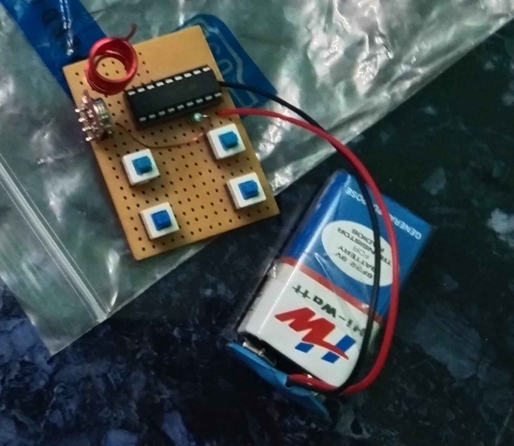

# Intelligent School Zone Speed Control and Safety System

This project aims to improve road safety by automatically controlling vehicle speed in school zones using IoT and RF communication technologies.

## Features

- Speed Limit Control: Automatically slows down vehicles within the school zone.
- Pre-zone Alert: Buzzer alerts 100 meters before entering the school zone.
- Speed Adjustment: Manual +10/-10 speed buttons for driver control outside the zone.
- Emergency Stop: If the vehicle doesn't slow down, it stops automatically in the school zone.

## Components Used

- Arduino Uno
- RF Transmitter (433 MHz) with HT12E
- RF Receiver with HT12D
- LCD Display
- Buzzer
- Push Buttons (+10 / -10)

## Components Images

<h3>Transmitter place in School</h3>

<h3>Receiver placed in Vehicle</h3>

## How It Works

1. RF transmitter (HT12E) sends a signal from the school zone.
2. The receiver (HT12D) on the vehicle receives the signal via RF module.
3. Arduino processes the signal and activates:
   - Buzzer
   - Speed control logic
   - Display messages on LCD

## Circuit Diagram

 
## Installation

1. Connect all hardware as per the circuit.
2. Upload the Arduino code to the board.
3. Power both the transmitter and receiver sides.
4. Test the speed control functionality when vehicle enters the school zone.

## Project Demo

[Watch Demo on Google Drive](https://drive.google.com/file/d/1GPph5PEA3YtiZM3ow_xLVxR_vD-Ir1WQ/view?usp=sharing)

## Credits

This project was developed by a team of AI & Data Science students:

- Naveenbalaji S – Circuit design , Arduino programming and RF communication setup
- Sanjai R – Sensor integration and testing
- Naveenbalaji S & Sanjai R – Report writing and documentation

Project developed as part of the mini-project submission at Vel Tech Multi Tech Dr. Rangarajan Dr. Sakunthala Engineering College.

Special thanks to our faculty guide Ms.R.Daisy Merina.,M.E.,Assistant professor for support and mentorship.
